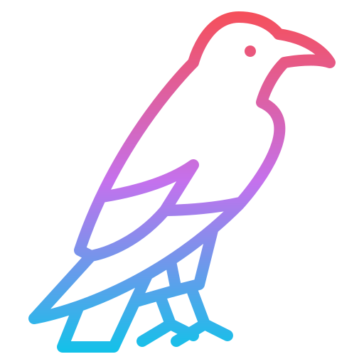

<h1 align="center">raven</h1>

<div align="center">
	
	<br/>
	raven ∙ simple price tracker
</div>


## About
raven is built as a mono repo consisting of 3 services that work together to create a simple price tracking application.
* `raven_api` - Python
* `raven_scraper` - Python. Scheduler that scrapes Amazon to get current pricing for each product being tracked.
* `raven_ui` - React based UI

## Requirements
- [poetry](https://github.com/python-poetry/poetry "poetry")
- Python 3.10^
- npm
- http-server

## Install
Clone project
```shell
git clone https://github.com/jess192/raven.git
```

### Backend
Install python based stuff
```shell
poetry install
```

### Frontend
Install react project
```shell
npm install --prefix raven_ui
```

## Usage

### Backend
Run API
```shell
poetry run python raven_api
```

Run scraper
```shell
poetry run python raven_scraper
```

### Frontend
```shell
npm run start --prefix raven_ui
```


<br/>
<a href="https://www.flaticon.com/free-icons/raven" title="raven icon" style="font-size: 11px;}">raven icon created by Flat Icons - Flaticon</a>

